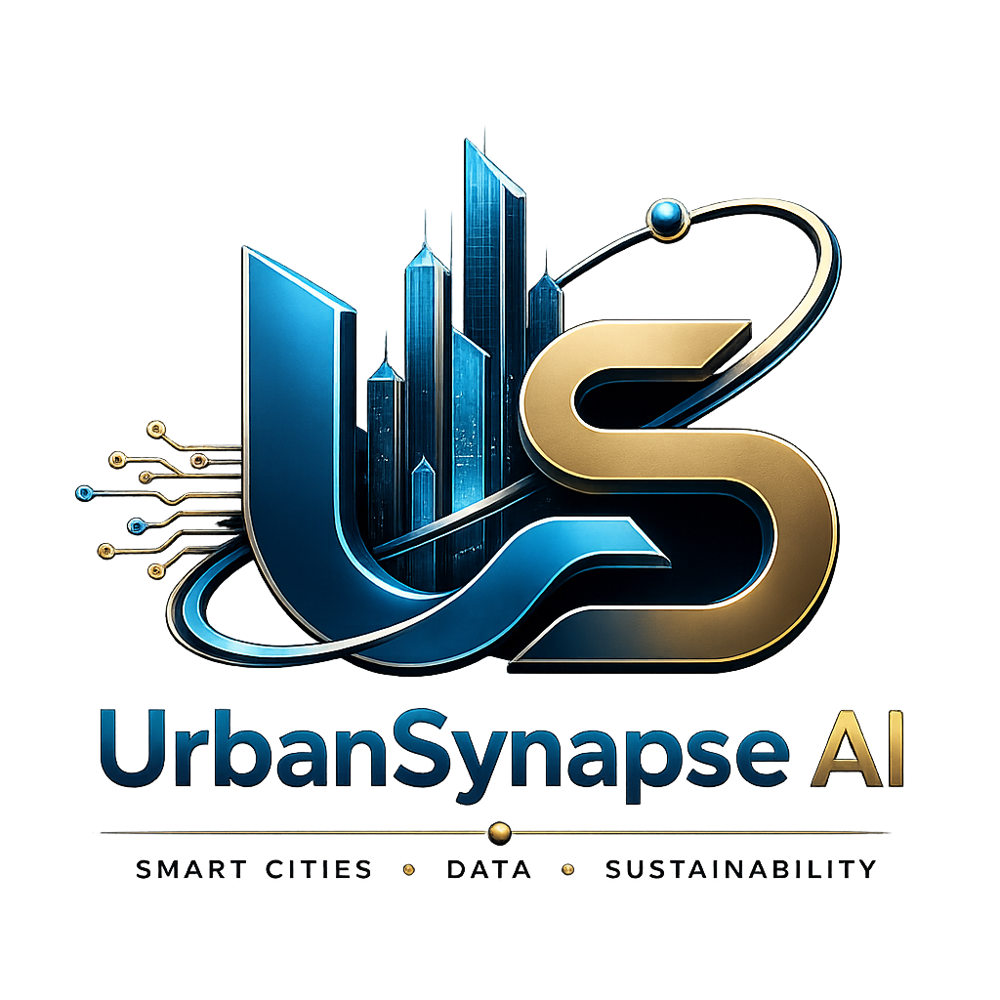

<div align="center">
  
  <h1>UrbanSynapse AI</h1>
  <p><strong>Plateforme d'intelligence territoriale prédictive</strong><br/>
  Smart Cities · Data · Sustainability</p>
</div>

---

## 1. Présentation

**UrbanSynapse AI** est une plateforme d'intelligence territoriale prédictive intégrée, conçue pour répondre aux défis de la planification urbaine durable dans les villes algériennes et du Sud global.

Elle articule **systèmes d'information géographique (SIG)**, **modélisation multicritère**, **intelligence artificielle** et **simulation énergétique** pour offrir un cadre décisionnel permettant l'analyse multi-échelles (territoire → quartier → bâtiment) des dynamiques urbaines, des performances énergétiques et des vulnérabilités climatiques.

L'originalité de la plateforme réside dans l'intégration systémique de la **rénovation énergétique du bâti existant** au sein d'une vision territoriale globale — dimension absente des outils de planification conventionnels (PDAU, POS, études sectorielles).

> Objectif : faire passer la planification urbaine algérienne d'une approche **descriptive et fragmentée** vers une **intelligence territoriale prédictive, résiliente et performante**.

---

## 2. Stack technique

| Couche | Technologies |
|--------|--------------|
| **Frontend** | React 18 · Vite · TypeScript · TailwindCSS · TanStack Query · Zustand · MapLibre GL / deck.gl · Recharts |
| **Backend** | Python 3.12 · FastAPI · Pydantic v2 · SQLAlchemy 2 · GeoAlchemy2 |
| **Base de données** | PostgreSQL 16 + **PostGIS** 3.4 |
| **Géospatial** | Shapely · GeoPandas · PyProj · Rasterio |
| **IA / ML** | scikit-learn · XGBoost · NumPy · Pandas |
| **Tâches asynchrones** | Celery + Redis |
| **Infra** | Docker Compose · Nginx · GitHub Actions (CI) |

---

## 3. Architecture (vue d'ensemble)

```
┌──────────────────────────────────────────────────────────────┐
│                       NAVIGATEUR (SPA React)                   │
│  Dashboard · Analyse territoriale (carte) · Simulation · …     │
└───────────────┬──────────────────────────────────────────────┘
                │ HTTPS / REST (JSON, GeoJSON)
┌───────────────▼──────────────────────────────────────────────┐
│                     API FastAPI (/api/v1)                      │
│  Endpoints  →  Services (scoring, energy)  →  ML (predictor)   │
│                          │                                     │
│         GIS layer (Shapely/PyProj)   Celery tasks (Redis)      │
└───────────────┬──────────────────────────────┬───────────────┘
                │ SQLAlchemy + GeoAlchemy2      │
┌───────────────▼──────────────┐   ┌────────────▼──────────────┐
│  PostgreSQL 16 + PostGIS      │   │   Redis (broker/cache)    │
│  territories · zones ·        │   │                           │
│  buildings · indicators ·     │   └───────────────────────────┘
│  scenarios · users            │
└───────────────────────────────┘
```

Voir le détail dans [`docs/architecture.docx`](docs/) et [`docs/cahier-des-charges.docx`](docs/).

---

## 4. Démarrage rapide

> **Choix de la base de données — 3 guides dédiés dans `docs/` :**
> - `INSTALL_SQLITE.md` — le plus simple, aucune installation (recommandé pour démarrer)
> - `INSTALL_POSTGRES.md` — PostgreSQL + PostGIS (géospatial complet, production)
> - `INSTALL_WINDOWS.md` — dépannage de l'installation Python/Node sur Windows
>
> Dans tous les cas, créer les tables avec `python -m scripts.init_db`
> (et **non** `alembic upgrade head`, pas de migrations générées pour l'instant).

### Option A — Docker (recommandé)

```bash
git clone <repo> urbansynapse && cd urbansynapse
cp backend/.env.example backend/.env
cp frontend/.env.example frontend/.env
docker compose up --build
```

- Frontend : http://localhost:5173
- API + docs Swagger : http://localhost:8000/docs

### Option B — Local

**Backend**
```bash
cd backend
python -m venv .venv && source .venv/bin/activate   .venv\Scripts\activate
pip install -r requirements.txt
python -m scripts.init_db
cp .env.example .env
alembic upgrade head
uvicorn app.main:app --reload
```

> **Windows** : si l'installation de `pyproj`/`shapely` échoue (erreur `proj executable not found`),
> voir [`docs/INSTALL_WINDOWS.md`](docs/INSTALL_WINDOWS.md). Démarrage rapide sans géospatial :
> `pip install -r requirements-core.txt` puis `python -m uvicorn app.main:app --reload`.

**Frontend**
```bash
cd frontend
npm install
cp .env.example .env
npm run dev
```
npm install --save-dev typescript@5.6.3

---

## 5. Structure du dépôt

```
urbansynapse/
├── backend/                  # API FastAPI + IA + SIG
│   ├── app/
│   │   ├── api/v1/           # routeur + endpoints REST
│   │   ├── core/            # config, sécurité (JWT)
│   │   ├── db/              # session SQLAlchemy / Base
│   │   ├── models/         # ORM : territory, indicator, user
│   │   ├── schemas/        # DTO Pydantic
│   │   ├── services/       # scoring multicritère, simulation énergétique
│   │   ├── gis/            # opérations géospatiales (reprojection, aires)
│   │   ├── ml/             # predictor + pipelines + training
│   │   ├── tasks/          # Celery
│   │   └── main.py         # point d'entrée FastAPI
│   ├── alembic/            # migrations base de données
│   ├── tests/              # unit + integration
│   └── requirements.txt
│
├── frontend/                # SPA React + Vite + TS
│   ├── src/
│   │   ├── api/            # client axios + endpoints
│   │   ├── components/     # ui · charts · map · layout
│   │   ├── features/       # modules métier
│   │   ├── layouts/        # DashboardLayout
│   │   ├── pages/          # Dashboard · Analyse · Simulation
│   │   ├── store/          # Zustand
│   │   └── types/          # typages partagés
│   └── package.json
│
├── infra/                   # docker, nginx, k8s
├── data/                    # raw · processed · geojson
├── docs/                    # architecture + cahier des charges
├── scripts/                 # utilitaires (ETL, seed…)
├── docker-compose.yml
└── .github/workflows/ci.yml
```

---

## 6. Modules fonctionnels

| Module | Description |
|--------|-------------|
| **Tableau de bord** | KPIs territoriaux temps réel (performance énergétique, résilience, CO₂, qualité de l'air) |
| **Analyse territoriale** | Cartographie SIG multi-couches (occupation du sol, réseaux énergétiques, risques) |
| **Simulation urbaine** | Comparaison de scénarios (référence, optimisé énergétique, résilient, compact urbain) |
| **Mobilité & Accessibilité** | Flux de mobilité, accessibilité des services |
| **Résilience urbaine** | Vulnérabilités climatiques, îlots de chaleur |
| **Performance énergétique** | Simulation de rénovation du bâti existant (isolation, vitrage, CVC, PV) |
| **Risques naturels** | Inondation, séisme, feu de forêt |
| **Rapports** | Export de synthèses décisionnelles |

---

## 7. Tests & qualité

```bash
cd backend && pytest -q          # tests backend
cd frontend && npm run build     # vérification build + types
```

CI automatique via GitHub Actions à chaque push / PR.

---

## 8. Sources scientifiques

Le dossier `docs/` référence les bilans énergétiques nationaux algériens (2019–2024), les rapports de transition énergétique, et les documents d'urbanisme (PDAU/POS) ayant servi de base à la calibration des modèles.

---

## 9. Licence

MIT — voir [`LICENSE`](LICENSE).
